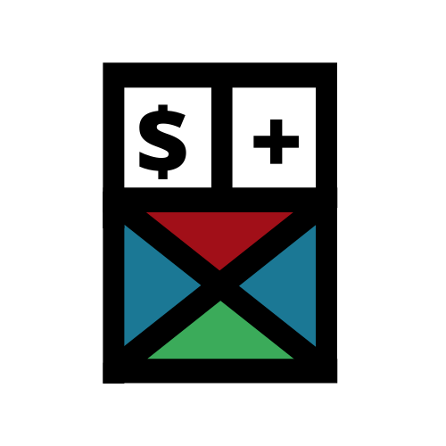
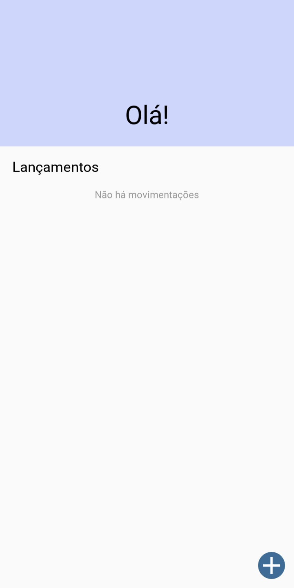
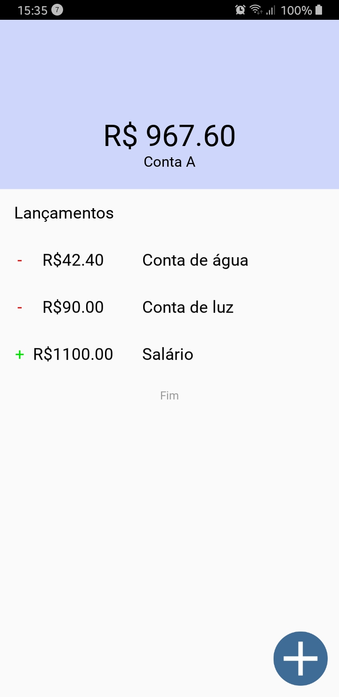
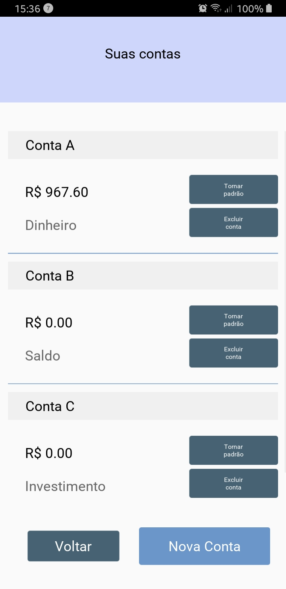
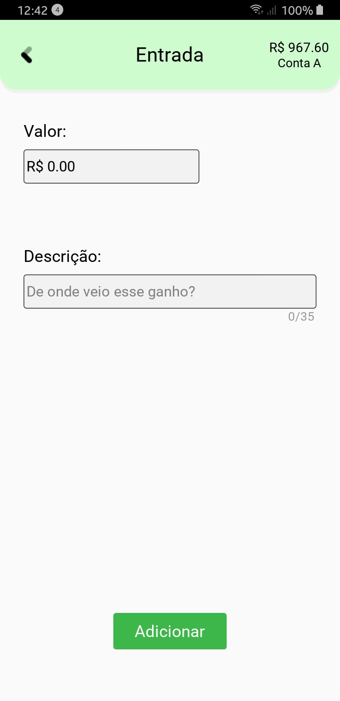
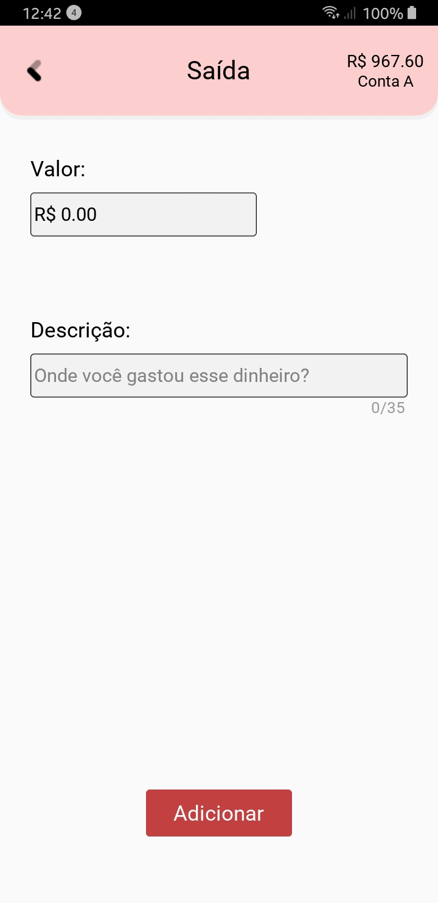
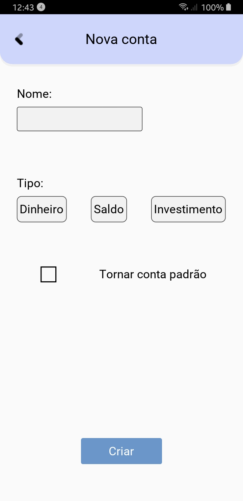

<div align='center'>
 
</div>
<h1 align="center">Economize!</h1>
<p align="center">Aplicativo Android feito em Kivy para controlar gastos de forma mais simples e objetiva</p>


<p align="center">
 <a href="#objetivo">Objetivo</a> •
 <a href="#requisitos">Pré-requisitos e run</a> • 
 <a href="#tecnologias">Tecnologias</a> • 
 <a href="#galeria">Galeria</a> • 
 <a href="#autor">Autoria</a>
</p>

<div align='center'>
   
  
  
</div>

<h2 id='objetivo'>Objetivo</h2>
Os aplicativos disponíveis são ótimos (mesmo usando a versão gratuita), mas aqueles gráficos e a quantidade absurda de funções estava me distraindo mais que ajudando. Visto isso, o Economize! vem como uma ferramenta objetiva e simples de acompanhar os gastos!

<h2 id='requisitos'> Pré-requisitos e run </h2>
Se quiser rodar em seu **Computador** você vai seguir os seguintes passos:

**1. Ativar o ambiente virtual**

  Na pasta principal do programa, rodar: 

* **Para distros linux**
  ```
  source ./bin/activate
  ```

* **Para windows**
  ```
  outra coisa
  ```


**2. Rodar o programa**

  Com o ambiente virtual ativado, rodar:

  ```
  python main.py -m screen:phone_nexus_5,scale=.4,portrait
  ```

Se desejar rodar em seu **celular**, basta ir [nas nossas tags](https://github.com/laribrito/Economize/releases) para visualizar as releases existentes, baixar e instalar em seu aparelho.
<br> *Obs.: Somente ANDROID*

<h2 id='galeria'>Galeria v1.2.0</h2>

|<p>• Tela de inicio com botões à mostra</p> |<p>• Tela de inicio depois do uso</p> | <p>• Tela para gerenciar as contas<br>cadastradas</p>  |
|----------------|-------------------------------|-----------------------------|
|<p><b>• Tela para adicionar um ganho</b></p> | <p><b>• Tela para adicionar uma retirada</b></p>  | <p><b>• Tela para adicionar uma conta</b></p> |


<h2 id='tecnologias'>Tecnologias</h2>

As seguintes ferramentas foram usadas na construção do projeto:

- [Kivy 2.0.0](https://kivy.org/#home)
- [Python 3.6.9](https://www.python.org/)


<h2 id='autor'> Autora </h2>
<a href="https://github.com/laribrito">
 
 <br />
 <sub><b>Sim, sou eu!</b></sub></a>


Feito por Larissa de Brito 👋🏽 Entre em contato!

[](https://twitter.com/laribrit0) 
[](https://www.linkedin.com/in/larissa-brit0/) 
[](mailto:lary.29.ds@gmail.com)
